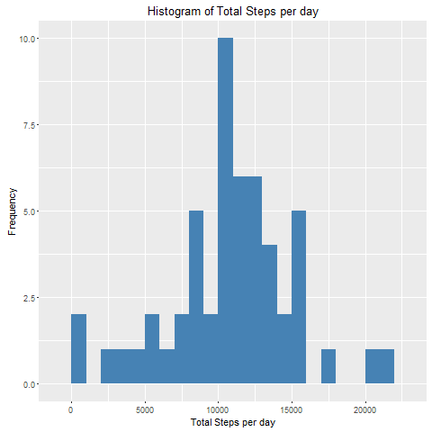
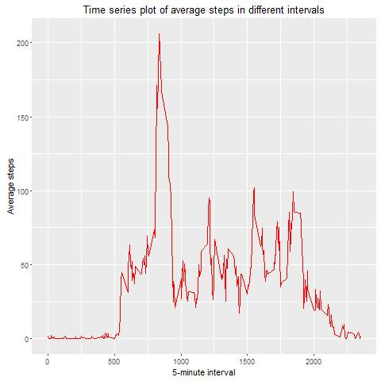
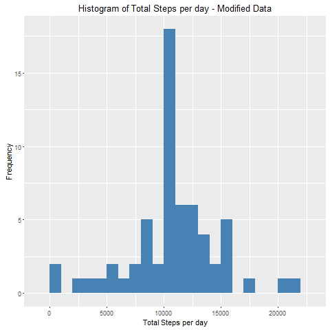
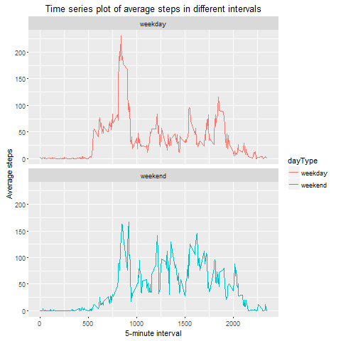

## Prepare markdown environemnt

```r
library(knitr)
opts_chunk$set(echo = TRUE)
```

##Loading necessary libraries

```r
library(ggplot2)
library(dplyr)
```

##Precondition
Download ```activity.zip``` file and unzip the ```activity.csv``` file in the ```./data``` directory under the current directory.

## Loading and preprocessing the data

1. Reading data from ```activity.csv``` file. Three attributes (```steps```, ```date```, ```interval```) are ```integer```, ```Date``` and ```integer```, respectively.

```r
fileUrl <- "./data/activity.csv"
attribClasses = c("integer", "Date", "integer")
activityDataRaw <- read.csv(fileUrl, head=TRUE, colClasses=attribClasses, na.strings="NA")
```

2. Filter out the missing values (NA) from the ```activityDataRaw``` variable. The modified data is saved in ```activityDataFiltered``` variable.

```r
activityDataFiltered <- activityDataRaw[complete.cases(activityDataRaw),]
```

## What is mean total number of steps taken per day?

1. Calculate the total number of steps taken per day

```r
dailyTotalSteps <- tapply(activityDataFiltered$steps, activityDataFiltered$date, sum, na.rm = TRUE, simplify = T)

df.dailyTotalSteps <- as.data.frame(dailyTotalSteps)
```

2. Ploting the bar graph for total steps per day. Here, we used ```ggplot```.

```r
ggplot(df.dailyTotalSteps, aes(x= df.dailyTotalSteps$dailyTotalSteps))+
    geom_histogram(fill = "steelblue", binwidth = 1000)+
    labs(title = "Histogram of Total Steps per day", x = "Total Steps per day", y = "Frequency")
```



3. Calculate and report the mean and median of the total number of steps taken per day

```r
meanSteps <- mean(dailyTotalSteps)
medianSteps <- median(dailyTotalSteps)
```

Mean of total daily total steps 

```
## [1] 10766.19
```

Median of total daily total steps

```
## [1] 10765
```


## What is the average daily activity pattern?

1. Calculate average steps taken in each 5-minute interval per day.

```r
dailyAverageSteps <- tapply(activityDataFiltered$steps, activityDataFiltered$interval, mean, na.rm = TRUE, simplify = T)
df.dailyAverageSteps <- data.frame(interval=as.integer(names(dailyAverageSteps)), avgStep=dailyAverageSteps)
```

Plot the time series of average steps for 5-minute interval per day. We used ```ggplot```.

```r
ggplot(df.dailyAverageSteps, aes(x=interval, y=avgStep)) +
    geom_line(color = "red")+
    labs(title = "Time series plot of average steps in different intervals", x = "5-minute interval", y = "Average steps")
```




2. Interval with maximum average steps, 

```
##     interval  avgStep
## 835      835 206.1698
```

## Imputing missing values

1. Calculate and report the total number of missing values in the dataset

Create a new variable, ```activityDataModified```.


```r
activityDataModified <- activityDataRaw
```
Total number of missing values, 

```r
sum(is.na(activityDataModified))
```

```
## [1] 2304
```

2. Fill the missing values with average number of steps in the same 5-minute interval

```r
missingRows <- is.na(activityDataModified$steps)

activityDataModified$steps[missingRows] <- dailyAverageSteps[as.character(activityDataModified$interval[missingRows])]
```

Now, check total number of missing values, 

```r
sum(is.na(activityDataModified))
```

```
## [1] 0
```


3. Variable ```activityDataModified``` contains the original data along with calculated and replaced missing data.

4. Make a histogram of the total number of steps taken each day, for the modified data.

```r
dailyTotalStepsModified <- tapply(activityDataModified$steps, activityDataModified$date, sum, na.rm = TRUE, simplify = T)

df.dailyTotalStepsModified <- as.data.frame(dailyTotalStepsModified)
```

Plotting the histogram.

```r
ggplot(df.dailyTotalStepsModified, aes(x= df.dailyTotalStepsModified$dailyTotalStepsModified))+
    geom_histogram(fill = "steelblue", binwidth = 1000)+
    labs(title = "Histogram of Total Steps per day - Modified Data", x = "Total Steps per day", y = "Frequency")
```



Mean of the modified total steps, 

```
## [1] 10766.19
```

Median of the modified total steps, 

```
## [1] 10766.19
```

The impact of imputing missing data with the average number of steps in the same 5-min interval is that both the mean and the median for the modified data are equal to the same value: 

```
## [1] 10766.19
```

## Are there differences in activity patterns between weekdays and weekends?

1. User ```dplyr``` and ```mutate``` to create a new attribute/column named ```dayType```, and assign ```weekend``` or ```weekday``` value based on the ```weekdays()``` function.


```r
activityDataModified <- mutate(activityDataModified, 
                               dayType = ifelse(weekdays(activityDataModified$date) == "Saturday" | weekdays(activityDataModified$date) == "Sunday", "weekend", "weekday"))

activityDataModified$dayType <- as.factor(activityDataModified$dayType)
```

2. Calculate average steps in 5-minute interval per day.

```r
dayTypeAvgSteps <- aggregate(data = activityDataModified, steps~dayType+interval, FUN = mean)

df.dayTypeAvgSteps <- as.data.frame(dayTypeAvgSteps)
```

Plot average steps in 5-minute interval for ```weekend``` and ```weekday```.

```r
ggplot(df.dayTypeAvgSteps, aes(x=interval, y=steps, color = dayType)) +
    geom_line() +
    facet_wrap(~dayType, ncol = 1, nrow=2)+
    labs(title = "Time series plot of average steps in different intervals", x = "5-minute interval", y = "Average steps")
```



### Observation
From the two plots it seems that the test object is more active earlier in the day during weekdays compared to weekends. But, for throughout the weekend days, test object is observed  more active  compared with weekdays.
